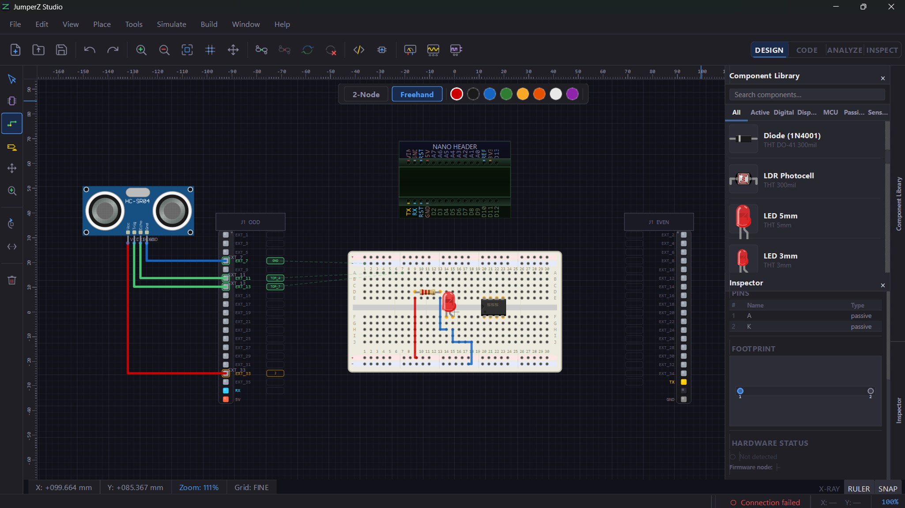
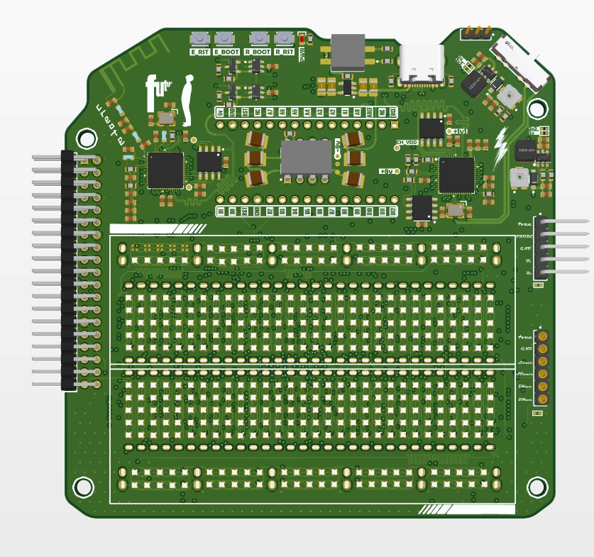
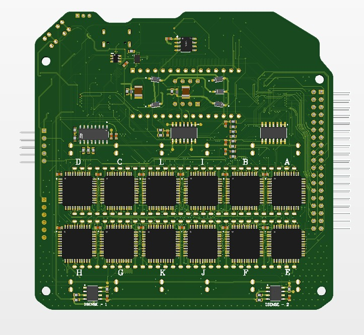
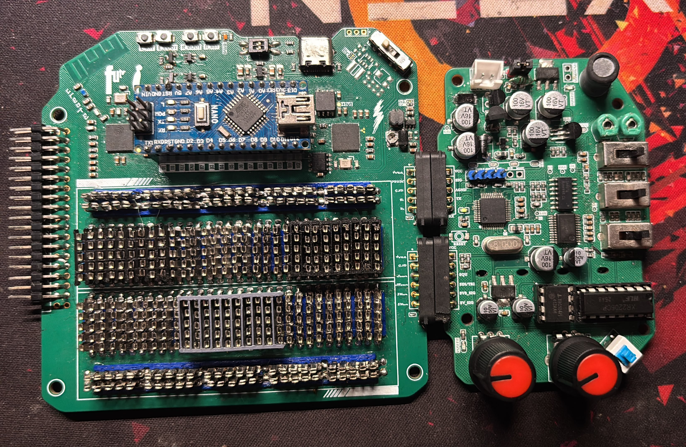
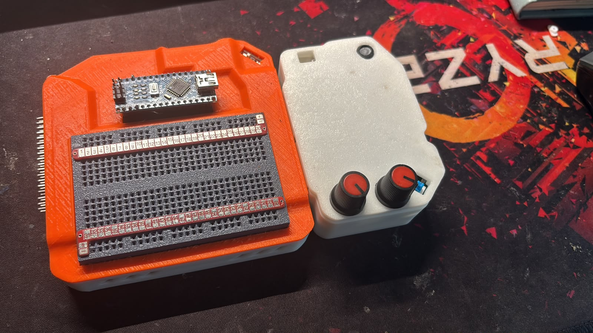
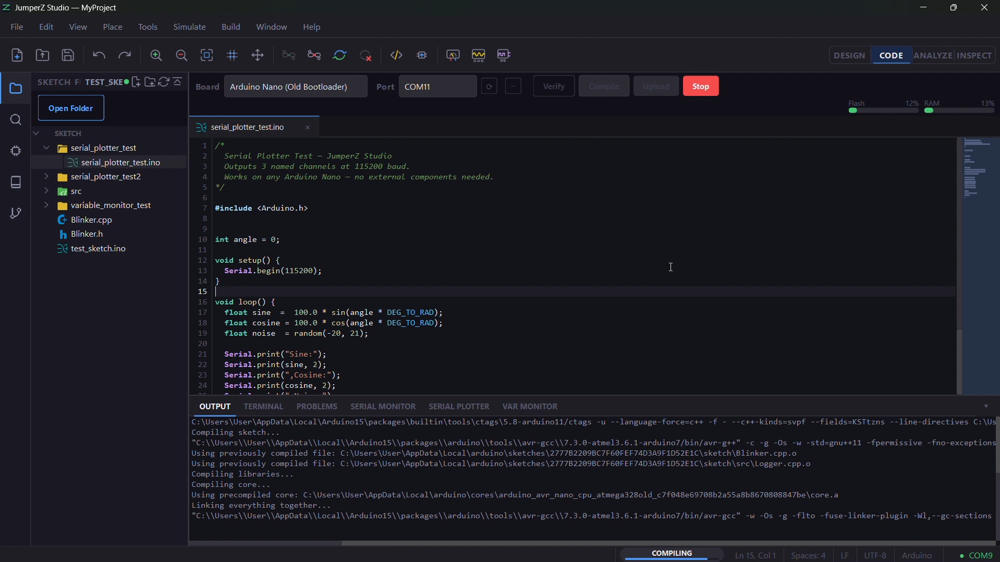
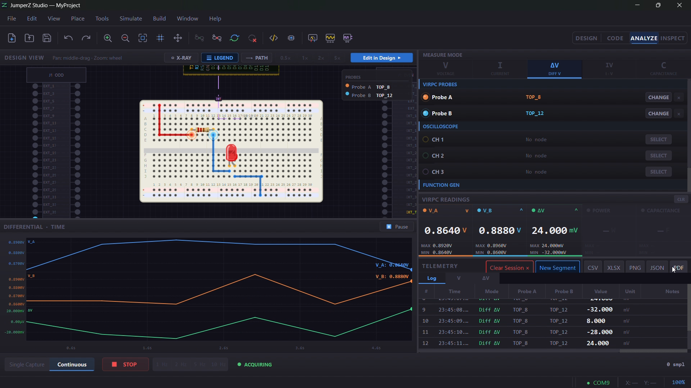
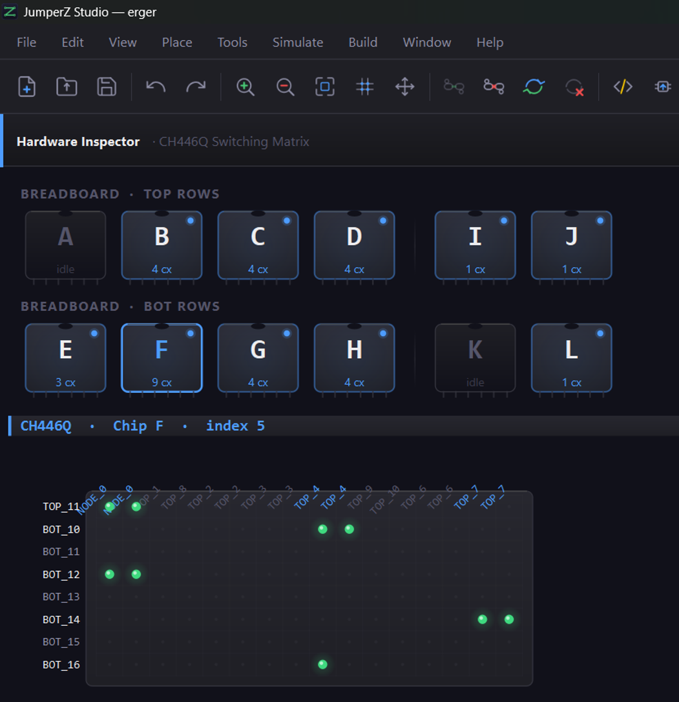

  

# JumperZ Studio

Professional desktop EDA application that bridges a physical breadboard with
a digital design canvas. Users design a circuit visually; the software
reconfigures real hardware in real time through a 400-node analog switching
matrix, with live LED feedback and current/voltage measurement.

## Team

3-person Final Year Project (SLIIT).

- **Gamunu Agalawatte** — desktop software (sole developer) and physical/mechanical system lead
- Teammate — main PCB schematic capture & routing (400-node switching matrix board)
- Teammate — add-on PCB: pluggable oscilloscope + function-generator module

## My Role

Sole developer of the desktop application (~150 Python modules), and lead
of the physical system design: PCB **outlines** (board shape, not schematic
or routing) in AutoCAD, the magnetic pogo-pin inter-board connector, the
breadboard spring-clip mechanism, and the 3D-printed enclosure. Schematic
capture and copper routing on the main board were done by a teammate.

## Hardware & Physical Build

  
  

*Main 6-layer board. Top layer: RP2040, USB-C, RESET/BOOT buttons, and the
breadboard-position pad matrix. Bottom layer: the 12× CH446Q switching
matrix ICs and dual INA219 current-sense ICs.*

  

*Main board (left) and the add-on oscilloscope/function-generator board
(right), joined by the magnetic pogo-pin inter-board connector — the two
black connector blocks in the middle.*

  

*The two 3D-printed enclosures: the main unit (left) housing the
breadboard interface, and the add-on unit (right) with its
oscilloscope/function-generator control knobs.*

## The App — Workspaces

### Design

  

Drag components from the library onto a virtual breadboard canvas. Each
virtual position (e.g. `TOP_4`, `EXT_7`) maps to a real physical node on the
hardware breadboard, so a completed design can be pushed straight to hardware.

### Code

  

Built-in Arduino-compatible code editor with board/port selection and
compile/upload handled via `arduino-cli` — write and flash sketches without
leaving the app.

### Analyze

  

Live differential-voltage probes and graphing, with telemetry logging
exportable to CSV, XLSX, PNG, JSON, or PDF. The oscilloscope and
function-generator channels shown here are powered by the pluggable add-on
PCB built by a teammate.

### Inspect *(in progress)*

  

Experimental "digital twin" view of the CH446Q switching matrix — the goal
is to visualize exactly which matrix nodes switch after a design is synced
to hardware. Still being tested, not yet feature-complete.

## Hardware Highlights

- Custom RP2040/ESP32 mainboard driving a 12× CH446Q analog switching matrix
- 400 individually addressable WS2812B LEDs for live visual feedback
- Dual INA219 sensors for live current/voltage sensing
- 6-layer main PCB
- Pluggable add-on PCB (oscilloscope + function generator) via a magnetic pogo-pin connector

## Software Highlights

- Six-layer domain-driven architecture (Core, Domain, Infrastructure, Services, UI, App) with enforced one-way dependencies
- Thread-safe publish–subscribe event bus coordinating hardware I/O across 6 background threads, dispatched safely onto the Qt main thread
- USB CDC four-port communication protocol with a custom JSON command schema
- Circuit netlist builder (Union-Find with path compression) and a Manhattan-style routing algorithm visualizing connections across the 400-node LED matrix
- Built-in Arduino-compatible code editor with compile/upload via `arduino-cli`

## Tech Stack

Python · PySide6 (Qt6) · Multithreading · USB CDC · JSON protocol · arduino-cli · AutoCAD · RP2040 · ESP32 · CH446Q · WS2812B · INA219

## Status

Hardware and core software complete and functional. The Inspect workspace
(hardware digital-twin view) is an experimental work in progress.
